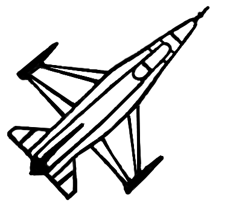
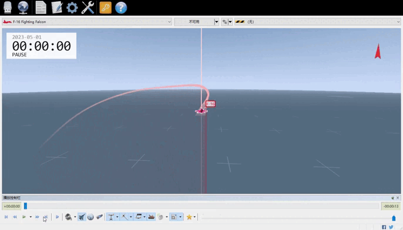
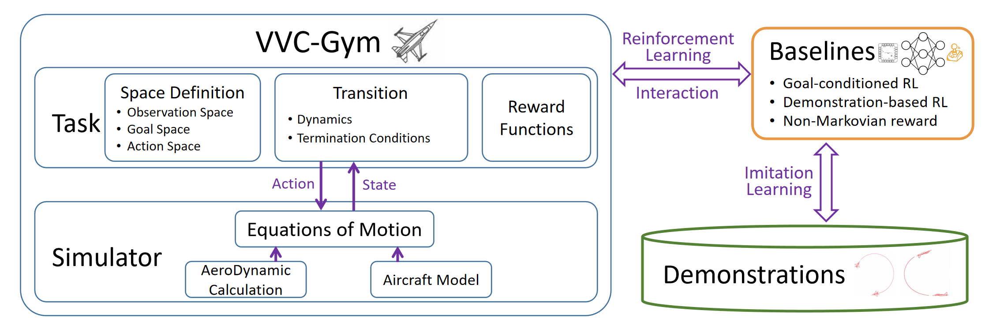

# Fly-Craft 

An efficient goal-conditioned reinforcement learning environment for fixed-wing UAV velocity vector control based on **Gymnasium**.

[](https://pypi.org/project/flycraft/)
[](https://pepy.tech/project/flycraft)
[](LICENSE.txt)
[](https://openreview.net/forum?id=5xSRg3eYZz)

## <a id="demostrations"></a>Demostrations

The policies are trained by "Iterative Regularized Policy Optimization with Imperfect Demonstrations (ICML2024)". [Code](https://github.com/GongXudong/IRPO)

### <a id="descending_turn"></a>Target velocity vector (v, $\mu$, $\chi$) from (200, 0, 0) to (140, -40, -165)



### <a id="ascending_turn"></a>Target velocity vector (v, $\mu$, $\chi$) from (200, 0, 0) to (120, 50, 170)


## Table of Contents

- [Demostrations](#demostrations)
  - [A descending turn](#descending_turn)
  - [An ascending turn](#ascending_turn)
- [Installation](#installation)
  - [From PyPI](#install_from_pypi)
  - [From source](#install_from_source)
- [Usage](#usage)
  - [Basic usage](#usage_basic)
  - [Four environment initialization methods](#usage_initialize_env)
  - [Visualization](#usage_visualization)
- [Applications](#applications)
  - [Application examples](#application_examples)
  - [Researches on FlyCraft](#application_papers)
- [Architecture](#architecture)
- [Configuration Details](#config)
  - [Task](#config_task)
  - [Desired Goal](#config_dg)
  - [Rewards](#config_reward)
  - [Terminations](#config_terminations)
  - [Cases](#config_cases)
- [Research Areas supported by FlyCraft](#research_area)
  - [Goal-Conditioned Reinforcement Learning](#research_area_gcrl)
  - [Demonstration-based Reinforcement learning](#research_area_rlfd)
  - [Exploration](#research_area_exploration)
  - [Curriculum Learning](#research_area_curriculum)
  - [Hierarchical Reinforcement Learning](#research_area_hierarchical)
  - [Continual Learning](#research_area_continual)
  - [Applications of Fixed-Wing UAVs](#research_area_applications)
- [Customize FlyCraft with Your Tasks](#customize_task)
  - [Define your customized task](#customize_task_def_task)
  - [Define your customized environment](#customize_task_def_env)
  - [Register your customized environment](#customize_task_register_env)
  - [Test/Run your customized environment](#customize_task_run)
- [Citation](#citation)

## <a id="installation"></a>Installation

### <a id="install_from_pypi"></a>Using PyPI

```bash
pip install flycraft
```

### <a id="install_from_source"></a>From source

```bash
git clone https://github.com/GongXudong/fly-craft.git
pip install -e fly-craft
```

***NOTE***: Due to the use of dynamic libraries "\*.so"/"\*.dll", FlyCraft can only be used on **Linux** or **Windows**. As we have conducted comprehensive testing on Linux systems, we recommend deploying FlyCraft in one of the following environments:

* a native Linux operating system,
* a Linux subsystem activated via **Windows WSL**,
* a Linux container initiated through **Docker** on macOS/Windows.

## <a id="usage"></a>Usage

### <a id="usage_basic"></a>Basic usage

```python
import gymnasium as gym
import flycraft

env = gym.make('FlyCraft-v0')  # use default configurations
observation, info = env.reset()

for _ in range(500):
    action = env.action_space.sample() # random action
    observation, reward, terminated, truncated, info = env.step(action)

    if terminated or truncated:
        observation, info = env.reset()

env.close()
```

### <a id="usage_initialize_env"></a>The four methods to initialize environment

```python
# 1.Initialize environment with default configurations
env = gym.make('FlyCraft-v0')

# 2.Initialize environment by passing configurations through config_file (Path or str)
env = gym.make('FlyCraft-v0', config_file=PROJECT_ROOT_DIR / "configs" / "NMR.json")

# 3.Initialize environment by passing configurations through custom_config (dict), this method will load default configurations from default path, then update the default config with custom_config
env = gym.make(
    'FlyCraft-v0', 
    custom_config={
        "task": {
            "control_mode": "end_to_end_mode",
        }
    }
)

# 4.Initialize environment by passing configurations through both config_file and custom_config. FlyCraft load config from config_file firstly, then update the loaded config with custom_config
env = gym.make(
    'FlyCraft-v0',
    config_file=PROJECT_ROOT_DIR / "configs" / "NMR.json",
    custom_config={
        "task": {
            "control_mode": "end_to_end_mode",
        }
    }
)
```

### <a id="usage_visualization"></a>Visualization

We provide a visualization method based on [Tacview](https://www.tacview.net/). For more details, please refer to [fly-craft-examples](https://github.com/GongXudong/fly-craft-examples).

## <a id="applications"></a>Applications

### <a id="application_examples"></a>Application examples

1. We provide a sister repository, [fly-craft-examples](https://github.com/GongXudong/fly-craft-examples), for flycraft, which offers a variety of training scripts based on [StableBaselines3](https://github.com/DLR-RM/stable-baselines3) and [Imitation](https://github.com/HumanCompatibleAI/imitation).

### <a id="application_papers"></a>Researches on FlyCraft

1. Xudong, Gong, et al. "***Improving the Continuity of Goal-Achievement Ability via Policy Self-Regularization for Goal-Conditioned Reinforcement Learning***." Forty-second International Conference on Machine Learning. **ICML, 2025**. [[Paper]](https://openreview.net/forum?id=xPMDwGL1TT)

2. Xudong, Gong, et al. "***VVC-Gym: A Fixed-Wing UAV Reinforcement Learning Environment for Multi-Goal Long-Horizon Problems***." International Conference on Learning Representations. **ICLR, 2025**. [[Paper]](https://openreview.net/forum?id=5xSRg3eYZz)

3. Xudong, Gong, et al. "***Iterative Regularized Policy Optimization with Imperfect Demonstrations***." Forty-first International Conference on Machine Learning. **ICML, 2024**. [[Paper]](https://openreview.net/pdf?id=Gp5F6qzwGK)

4. Xudong, Gong, et al. "***Goal-Conditioned On-Policy Reinforcement Learning***." Advances in Neural Information Processing Systems. **NeurIPS, 2024**. [[Paper]](https://openreview.net/pdf?id=KP7EUORJYI)

5. Xudong, Gong, et al. "***V-Pilot: A Velocity Vector Control Agent for Fixed-Wing UAVs from Imperfect Demonstrations***." IEEE International Conference on Robotics and Automation. **ICRA, 2025**. [[Paper]](https://ieeexplore.ieee.org/abstract/document/11128340/?casa_token=oHHVxdPUdVgAAAAA:5-us3vYs2S9S3fmyG-MnIuSponSWXJERUIEhLX845aukeXRcjN_CrYqVaK9reMbFK7ZsTBu-)

6. Dawei, Feng, et al. "***Think Before Acting: The Necessity of Endowing Robot Terminals With the Ability to Fine-Tune Reinforcement Learning Policies***." IEEE International Symposium on Parallel and Distributed Processing with Applications. **ISPA, 2024**. [[Paper]](https://ieeexplore.ieee.org/abstract/document/10885338/?casa_token=esVIEpSIOPIAAAAA:sgPFMD6RXQ8PNfaMVXdv8x6Ci1c5bRuxzV5yaxJQLxn6gByhoFpFseEl7CcjV61pt71L76-hOA)

## <a id="architecture"></a>Architecture



## <a id="config"></a>Configuration Details

[Here](https://github.com/GongXudong/fly-craft/tree/main/flycraft/configs/MR_for_HER.json) is an example of the configuration, which consists of 4 blocks:

### <a id="config_task"></a>Task

The configurations about task and simulator, including:

* **control_mode** Str: the model to be trained, *guidance_law_mode* for guidance law model, *end_to_end_mode* for end-to-end model
* **step_frequence** Int (Hz): simulation frequency.
* **max_simulate_time** Int (s): maximum simulation time, max_simulate_time * step_frequence equals maximum length of an episode.
* **h0** Int (m): initial altitude of the aircraft.
* **v0** Int (m/s): initial true air speed of the aircraft.

### <a id="config_dg"></a>Desired Goal

The configurations about the definition and sampling method of the desired goal, including:

* **use_fixed_goal** Boolean: whether to use a fixed desired goal.
* **goal_v** Float (m/s): the true air speed of the fixed desired goal.
* **goal_mu** Float (deg): the flight path elevator angle of the fixed desired goal.
* **goal_chi** Float (deg): the flight path azimuth angle of the fixed desired goal.
* **sample_random** Boolean: if don't use fixed desired goal, whether sample desired goal randomly from ([v_min, v_max], [mu_min, mu_max], [chi_min, chi_max])
* **v_min** Float (m/s): the min value of true air speed of desired goal.
* **v_max** Float (m/s): the max value of true air speed of desired goal.
* **mu_min** Float (deg): the min value of flight path elevator angle of desired goal.
* **mu_max** Float (deg): the max value of flight path elevator angle of desired goal.
* **chi_min** Float (deg): the min value of flight path azimuth angle of desired goal.
* **chi_max** Float (deg): the max value of flight path azimuth angle of desired goal.
* **available_goals_file** Str: path of the file of available desired goals. If don't use fixed desired goal and don't sample desired goal randomly, then sample desired goal from the file of available desired goals. The file is a .csv file that has at least four columns: v, mu, chi, length. The column 'length' is used to indicate whether the desired goal represented by the row can be achieved by an expert. If it can be completed, it represents the number of steps required to achieved the desired goal. If it cannot be completed, the value is 0.
* **sample_reachable_goal** Boolean: when sampling desired goals from *available_goals_file*, should only those desired goals with length>0 be sampled.
* **sample_goal_noise_std** Tuple[Float]: a tuple with three float. The standard deviation used to add Gaussian noise to the true air speed, flight path elevation angle, and flight path azimuth angle of the sampled desired goal.

### <a id="config_reward"></a>Rewards

The configurations about rewards, including:

* **dense** Dict: The configurations of the dense reward that calculated by the error on angle and on the true air speed
  * *use* Boolean: whether use this reward;
  * *b* Float: indicates the exponent used for each reward component;
  * *angle_weight* Float [0.0, 1.0]: the coefficient of the angle error component of reward;
  * *angle_scale* Float (deg): the scalar used to scale the error in direction of velocity vector;
  * *velocity_scale* Float (m/s): the scalar used to scale the error in true air speed of velocity vector.
* **dense_angle_only** Dict: The configurations of the dense reward that calculated by the error on angle only
  * *use* Boolean: whether use this reward;
  * *b* Float: indicates the exponent used for each reward component;
  * *angle_scale* Float (deg): the scalar used to scale the error in direction of velocity vector.
* **sparse** Dict: The configurations of the sparse reward
  * *use* Boolean: whether use this reward;
  * *reward_constant* Float: the reward when achieving the desired goal.

### <a id="config_terminations"></a>Terminations

The configurations about termination conditions, including:

* **RT** Dict: The configurations of the Reach Target Termination (used by non-Markovian reward)
  * *use* Boolean: whether use this termination;
  * *integral_time_length* Integer (s): the number of consecutive seconds required to achieve the accuracy of determining achievement;
  * *v_threshold* Float (m/s): the error band used to determine whether true air speed meets the requirements;
  * *angle_threshold* Float (deg): the error band used to determine whether the direction of velocity vector meets the requirements;
  * *termination_reward* Float: the reward the agent receives when triggering RT.
* **RT_SINGLE_STEP** Dict: The configurations of the Reach Target Termination (used by Markovian reward, judge achievement by the error of true airspeed and the error of angle of velocity)
  * *use* Boolean: whether use this termination;
  * *v_threshold* Float (m/s): the error band used to determine whether true air speed meets the requirements;
  * *angle_threshold* Float (deg): the error band used to determine whether the direction of velocity vector meets the requirements;
  * *termination_reward* Float: the reward the agent receives when triggering RT_SINGLE_STEP.
* **RT_V_MU_CHI_SINGLE_STEP** Dict: The configurations of the Reach Target Termination (used by Markovian reward, judge achievement by the error of true airspeed, the error of flight path elevator angle, and the error of flight path azimuth angle)
  * *use* Boolean: whether use this termination;
  * *v_threshold* Float (m/s): the error band used to determine whether true air speed meets the requirements;
  * *angle_threshold* Float (deg): the error band used to determine whether the direction of velocity vector meets the requirements;
  * *termination_reward* Float: the reward the agent receives when triggering RT_V_MU_CHI_SINGLE_STEP.
* **C** Dict: The configurations of Crash Termination
  * *use* Boolean: whether use this termination;
  * *h0* Float (m): the altitude threshold below which this termination triggers;
  * *is_termination_reward_based_on_steps_left* Boolean: whether calculate the reward (penalty) based on the max_episode_step and the current steps;
  * *termination_reward* Float: the reward when triggers this termination under the condition of 'is_termination_reward_based_on_steps_left == False'.
* **ES** Dict: The configurations of Extreme State Termination
  * *use* Boolean: whether use this termination;
  * *v_max* Float (m/s): the maximum value of true air speed. when the true air speed exceeding this value, this termination triggers;
  * *p_max* Float (deg/s): the maximum value of roll angular speed. when the roll angular speed exceeding this value, this termination triggers;
  * *is_termination_reward_based_on_steps_left* Boolean: whether calculate the reward (penalty) based on the max_episode_step and the current steps;
  * *termination_reward* Float: the reward when triggers this termination under the condition of 'is_termination_reward_based_on_steps_left == False'.
* **T** Dict: The configurations of Timeout Termination
  * *use* Boolean: whether use this termination;
  * *termination_reward* Float: the reward when triggers this termination.
* **CMA** Dict: The configurations of Continuously Move Away Termination
  * *use* Boolean: whether use this termination;
  * *time_window* Integer (s): the time window used to detect whether this termination condition will be triggered;
  * *ignore_mu_error* Float (deg): when the error of flight path elevator angle is less than this value, the termination condition will no longer be considered;
  * *ignore_chi_error* Float (deg): when the error of flight path azimuth angle is less than this value, the termination condition will no longer be considered;
  * *is_termination_reward_based_on_steps_left* Boolean: whether calculate the reward (penalty) based on the max_episode_step and the current steps;
  * *termination_reward* Float: the reward when triggers this termination under the condition of 'is_termination_reward_based_on_steps_left == False'.
* **CR** Dict: The configurations of Continuously Roll Termination
  * *use* Boolean: whether use this termination;
  * *continuousely_roll_threshold* Float (deg): when the angle of continuous roll exceeds this value, this termination condition is triggered;
  * *is_termination_reward_based_on_steps_left* Boolean: whether calculate the reward (penalty) based on the max_episode_step and the current steps;
  * *termination_reward* Float: the reward when triggers this termination under the condition of 'is_termination_reward_based_on_steps_left == False'.
* **NOBR** Dict: The configurations of Negative Overload and Big Roll Termination
  * *use* Boolean: whether use this termination;
  * *time_window* Integer (s): the time window used to detect whether this termination condition will be triggered;
  * *negative_overload_threshold* Float: when the overloat exceeds this value for at least 'time_window' seconds, this termination condition is triggered;
  * *big_phi_threshold* Float (deg): when the roll angle exceeds this value for at least 'time_window' seconds, this termination condition is triggered;
  * *is_termination_reward_based_on_steps_left* Boolean: whether calculate the reward (penalty) based on the max_episode_step and the current steps;
  * *termination_reward* Float: the reward when triggers this termination under the condition of 'is_termination_reward_based_on_steps_left == False'.

### <a id="config_cases"></a>Cases

1. Using fixed desired goal of $(u, \mu, \chi) = (100, -25, 75)$, [link](https://github.com/GongXudong/fly-craft-examples/blob/main/configs/env/fixed_target/env_config_for_ppo_100_-25_75.json).

2. Sampling desired goal $(u, \mu, \chi)$ randomly from $[150, 250] \times [-30, 30] \times [-60, 60]$, [link](https://github.com/GongXudong/fly-craft-examples/blob/main/configs/env/D2D/env_config_for_ppo_medium_b_05.json).

3. Sampling desired goal $(u, \mu, \chi)$ randomly from a pre-defined set (specified by config["goal"]["available_goals_file"]), [link](https://github.com/GongXudong/fly-craft-examples/blob/main/configs/env/IRPO/env_hard_guidance_MR_config_for_ppo_with_dg_from_demo1.json).

## <a id="research_area"></a>Research Areas supported by FlyCraft

### <a id="research_area_gcrl"></a>1. Goal-Conditioned Reinforcement Learning

FlyCraft is a typical multi-goal problem. Its interface adheres to the design principles of [Gymnasium-Robotics](https://github.com/Farama-Foundation/Gymnasium-Robotics). The observation is implemented using a dictionary type, which includes three keys: "*observation*", "*desired\_goal*", and "*achieved\_goal*". Additionally, it provides a *compute\_reward()* function. This design makes Flycraft compatible with many open-source Goal-Centric Reinforcement Learning (GCRL) algorithms, facilitating the direct reuse of these algorithms for GCRL research.

### <a id="research_area_rlfd"></a>2. Demonstration-based Reinforcement learning (Imitation Learning, Offline Reinforcement Learning, Offline-to-Online Reinforcement Learning)

We provide scripts for generating demonstration data using PID controllers and for updating demonstrations using trained RL policies. Users can utilize these scripts to generate their own demonstrations. Additionally, we have open-sourced eight datasets of varying quality and quantity, as listed below:

|Demonstration|Trajectory Number|Average Trajectory Length|Transition Number|Link|Collect Method|
|:-:|:-:|:-:|:-:|:-:|:-:|
|$D_E^0$|10,184|282.01±149.98|2,872,051|[link](https://www.openml.org/d/46000)|from PID|
|$\overline{D_E^0}$|10,264|281.83±149.48|2,892,731|[link](https://www.openml.org/d/46011)|Augment $D_E^0$|
|$D_E^1$|24,924|124.64±53.07|3,106,516|[link](https://www.openml.org/d/46012)|optimized $\overline{D_E^0}$ with RL trained policies|
|$\overline{D_E^1}$|27,021|119.64±47.55|3,232,896|[link](https://www.openml.org/d/46013)|Augment $D_E^1$|
|$D_E^2$|33,114|117.65±46.24|3,895,791|[link](https://www.openml.org/d/46014)|optimized $\overline{D_E^1}$ with RL trained policies|
|$\overline{D_E^2}$|34,952|115.76±45.65|4,045,887|[link](https://www.openml.org/d/46015)|Augment $D_E^2$|
|$D_E^3$|38,654|116.59±46.81|4,506,827|[link](https://www.openml.org/d/46016)|optimized $\overline{D_E^2}$ with RL trained policies|
|$\overline{D_E^3}$|39,835|116.56±47.62|4,643,048|[link](https://www.openml.org/d/46017)|Augment $D_E^3$|

For the specific details on how the datasets were generated, please refer to our ICLR 2025 paper: [VVCGym](https://openreview.net/pdf?id=5xSRg3eYZz).

### <a id="research_area_exploration"></a>3. Exploration

FlyCraft represents a typical exploration challenge problem, primarily due to the following complexities:

**Spatial Exploration Complexity (Multi-Goal)**: For non-recurrent policies, the policy search space becomes the Cartesian product of the state space, action space, and desired goal space. This significantly increases the challenge of finding effective policies.

**Temporal Exploration Complexity (Long-Horizon)**: Demonstrations typically exceed an average length of 100 steps, and some challenging tasks may require over 300 steps to complete successfully.

Furthermore, directly applying common RL algorithms like PPO or SAC on FlyCraft, even with dense rewards, yields policies with virtually no beneficial effect. Detailed experimental results are available in our ICLR 2025 paper: [VVCGym](https://openreview.net/pdf?id=5xSRg3eYZz).

### <a id="research_area_curriculum"></a>4. Curriculum Learning

Since common RL algorithms struggle to learn from scratch on FlyCraft, it serves as an suitable testbed for researching Curriculum Learning.

We recommend adjusting task difficulty through two primary methods:

(1) **Adjusting the Desired Goal Space**

A smaller desired goal space, closer to the initial state, makes the task easier. The aircraft's initial velocity is defined by env_config["task"]["v0"]. The initial values for the flight path elevator angle and flight path azimuth angle are both 0. The desired goal space is defined by the following configuration:

* Minimum desired true airspeed: env_config["goal"]["v_min"]
* Maximum desired true airspeed: env_config["goal"]["v_max"]
* Minimum desired flight path elevator angle: env_config["goal"]["mu_min"]
* Maximum desired flight path elevator angle: env_config["goal"]["mu_max"]
* Minimum desired flight path azimuth angle: env_config["goal"]["chi_min"]
* Maximum desired flight path azimuth angle: env_config["goal"]["chi_max"]

Additionally, users can define their own desired goal sampling strategy by referring to _tasks.goal_samplers.goal_sampler_for_velocity_vector_control.py_.

(2) **Adjusting the Action Space**

Different action spaces can be employed by setting env_config["task"]["control_mode"]:

* **end_to_end_mode**: The action space consists of final control commands: the deflections of the aileron actuator, elevator actuator, rudder actuator, and power level actuator. This mode exhibits significant oscillation in actions during training. Combined with the long-horizon nature of the Velocity Vector Control task, training suffers greatly from the temporal complexity of exploration.
* **guidance_law_mode**: The action space consists of intermediate control commands: roll rate command, overload command, and the position of the power level actuator. These three commands are then converted by a PD controller-based control law model into the deflections of the aileron actuator, elevator actuator, rudder actuator, and power level actuator. The PD controller-based control law model acts to smooth the actions, serving a purpose similar to the temporal abstraction provided by frame-skipping, thereby alleviating the temporal complexity of exploration.

A related Curriculum Learning study can be found in the NeurIPS 2024 paper: [GCPO](https://openreview.net/pdf?id=KP7EUORJYI).

### <a id="research_area_hierarchical"></a>5. Hierarchical Reinforcement Learning

The long-horizon nature of fixed-wing UAV tasks makes FlyCraft a suitable testbed for Hierarchical RL research. The task horizon can be adjusted by setting the simulation frequency env_config["task"]["step_frequence"]. We recommend setting the simulation frequency within the range of [10, 100], where a higher value corresponds to a longer task horizon.

For researchers wishing to avoid the long-horizon challenge, we suggest: (1) setting env_config["task"]["step_frequence"] to 10; (2) employing FrameSkip techniques.

### <a id="research_area_continual"></a>6. Continual Learning

Users can refer to the methods for modifying task difficulty described in the Curriculum Learning section to create different MDPs, thereby facilitating research in Continual Learning.

### <a id="research_area_applications"></a>7. Applications of Fixed-Wing UAVs

FlyCraft is fundamentally a simulation engine for fixed-wing UAVs. It allows researchers to study various fixed-wing UAV control problems by defining specific tasks. Currently, we have implemented:

**Velocity Vector Control**: This involves manipulating the UAV's velocity vector to match a desired velocity vector.
**Attitude Control**: This involves manipulating the UAV's attitude to match a desired attitude.

Potential future tasks include Basic Flight Maneuvers (BFMs) such as Level Turn, Slow Roll, and Knife Edge, among others.

In the next section, we use **Level Turn** as an example to demonstrate how to customize FlyCraft for the tasks you are concerned with.

## <a id="customize_task"></a>Customize FlyCraft with Your Tasks

In this section, we use the level turn in the BFM as an example to demonstrate how to customize FlyCraft for your specific tasks.

### <a id="customize_task_def_task"></a>1. Define your customized task

In the directory `flycraft/tasks/`, define your task, for example, in the file `BFM_level_turn_task.py`. In this file, you need to:

* **Define state**:
  1. Define the state variables via the function *get_state_vars()*.
  2. Extract the state variables defined by get_state_vars() from the aircraft's dictionary-form state using *convert_dict_to_state_vars()*.
  3. Define the lower bounds of the observed quantities via the function *get_state_lower_bounds()*, and define the upper bounds via the function *get_state_upper_bounds()*.
  4. For all available keys, please refer to the keys in the dictionary provided below:

  ```python
  Dict: {
    'lef': 0.0, 
    'npos': 202.93280838546622, 
    'epos': -0.0003178369761097856, 
    'h': 4997.945252461648, 
    'alpha': -3.8763871428920833, 
    'beta': 0.0028827414834535683, 
    'phi': -0.0007924768497675406, 
    'theta': -6.5392414504888485, 
    'psi': -0.003222236733571302, 
    'p': 0.0012092603223480781, 
    'q': -2.301811791467605, 
    'r': 0.0018719855098707125, 
    'v': 206.42898450413645, 
    'vn': 206.23466760853253, 
    've': -0.0014038370582571266, 
    'vh': -9.591781654339009, 
    'nx': 0.6544365026301127, 
    'ny': -0.00026289226844918224, 
    'nz': -0.8983464478861598, 
    'ele': -3.725121874665151, 
    'ail': -0.0017574644108460835, 
    'rud': -0.003584270151159641, 
    'thrust': 1.0, 
    'lon': 122.42499999666104, 
    'lat': 31.426828065405605, 
    'mu': -2.126962766563186, 
    'chi': -0.00031410986307750424
  }
  ```

* **Define desired goal**
  1. Define the goal via the function *get_goal_vars()*. All available keys are the same as those mentioned above.
  2. Define the lower bound of the desired goal via the function *get_goal_lower_bounds()*, and define the upper bound via the function *get_goal_upper_bounds()*.
  3. Define how to obtain the achieved goal corresponding to the current state via the function *get_achieved_goal()*.

* **Define termination functions**
  1. Define your customized termination functions in the directory `flycraft/terminations`. For example, `extreme_state_termination.py` represents terminating an episode when the aircraft reaches extreme velocities or extreme angular velocities.
  2. Define the specific configuration for your customized termination function in the config file. For the `extreme_state_termination.py` mentioned above, the configuration can be as follows:

  ```python
  {
    ...
    "terminations": {
      ...
      "ES": {
        "use": True,
        "v_max": 400,
        "p_max": 300,
        "is_termination_reward_based_on_steps_left": True,
        "termination_reward": -1,
      },
    }
  }
  ```

  3. Define how to parse your customized termination function in the function `_prep_termination_funcs()`. For example, the aforementioned `extreme_state_termination.py` can be parsed in the following manner:

  ```python
  ...
  elif tmnt == "ES":
    self.termination_funcs.append(
      ExtremeStateTermination(
        v_max=tmp_cfg["v_max"],
        p_max=tmp_cfg["p_max"],
        is_termination_reward_based_on_steps_left=tmp_cfg["is_termination_reward_based_on_steps_left"],
        termination_reward=tmp_cfg["termination_reward"],
        env_config=self.config,
      )
    )
  ```

  4. Define how to determine whether an episode has ended based on your customized termination function in the function `is_success()`.

* **Define reward functions**
  1. Define your customized reward functions in the directory `flycraft/rewards`. For example, `for_BFM_level_turn/dense_reward_based_on_velocity_chi.py`.
  2. Define the specific settings for your customized reward function in the configuration file. For example, regarding the aforementioned `for_BFM_level_turn/dense_reward_based_on_velocity_chi.py`, you can have the following configuration: 

  ```python
  {
    ...
    "rewards": {
      "dense": {
        "use": True,
        "b": 0.5
      },
    },
  }
  ```

  3. Define how to parse your customized reward function in the function *_prep_reward_funcs()*. For example, the aforementioned `for_BFM_level_turn/dense_reward_based_on_velocity_chi.py` can be parsed in the following manner:

  ```python
  ...
  if rwd == "dense":
    self.reward_funcs.append(
      DenseRewardBasedOnAngleAndVelocity(
        b=tmp_cfg.get("b", 0.5),
        mu_tolerance=tmp_cfg.get("mu_tolerance", 180),
        chi_scale=tmp_cfg.get("chi_scale", 180),
        velocity_scale=tmp_cfg.get("velocity_scale", 100),
        chi_weight=tmp_cfg.get("chi_weight", 0.5),
      )
  )
  ```

  4. Define how to determine whether an episode has ended based on your customized termination function in the function *is_success()*.

### <a id="customize_task_def_env"></a>2. Define your customized environment

In the same directory as `flycraft/env.py`, create a new file, for example, reference `env.py` to create your customized environment `env_level_turn.py`. Compared to `env.py`, this file requires very few modifications—essentially, you only need to change *VelocityVectorControlTask* to *BFMLevelTurnTask*.

### 3. <a id="customize_task_register_env"></a>Register your customized environment

Register your customized environment in `flycraft/__init__.py`.

```python
register(
    id="FlyCraft-Level-Turn-v0",
    entry_point="flycraft.env_level_turn:FlyCraftLevelTurnEnv",
)
```

### 4. <a id="customize_task_run"></a>Test/Run your customized environment

```python
env = gym.make("FlyCraft-Level-Turn-v0")
...
```

**NOTE**: *If your task has been thoroughly tested, feel free to submit a Pull Request to us. We will integrate your task into FlyCraft and release a new PyPI package.*

## <a id="citation"></a>Citation

Cite as

```bib
@inproceedings{gong2025vvcgym,
  title        = {VVC-Gym: A Fixed-Wing UAV Reinforcement Learning Environment for Multi-Goal Long-Horizon Problems},
  author       = {Gong, Xudong and Feng, Dawei and Xu, kele and Wang, Weijia and Sun, Zhangjun and Zhou, Xing and Ding, Bo and Wang, Huaimin},
  booktitle    = {International Conference on Learning Representations},
  year         = {2025}
}
```
